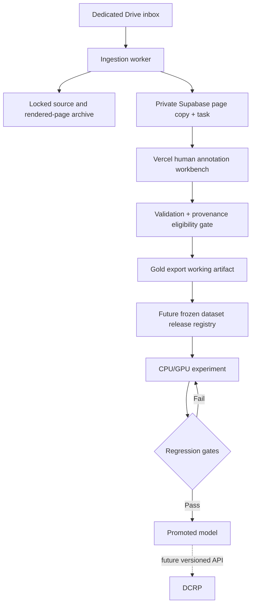
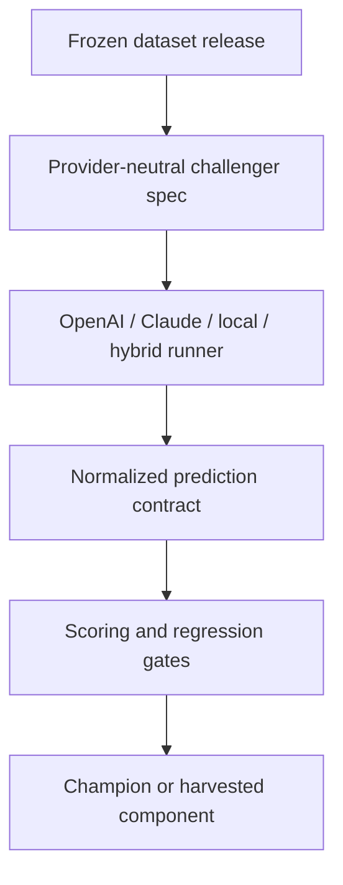

# DCAL architecture

Read `AI_HANDOFF.md` first for the current deployed snapshot and exact continuation context. This document describes the intended architecture and boundaries.

## Purpose

DCAL builds institution-specific page classification and document-reading models from human-reviewed BMCH material. It is an experimental, annotation, and dataset-governance system, not a clinical record application.

The current active product surface is the human annotation workbench. Model experimentation, promotion, and serving remain later milestones.

## Boundary

DCAL and DCRP have separate repositories, deployments, databases, credentials, and release cycles. No DCAL experiment may write into DCRP. A future promoted model may be exposed behind a versioned inference API that DCRP calls explicitly.

## Components

1. **Ingestion service** — a separate long-lived worker scans a dedicated Drive, validates patient/encounter/file hierarchy, renders pages, calculates checksums, generates opaque grouping IDs, archives originals/pages under content restrictions, uploads a private workbench copy, and creates idempotent tasks. It is not a Vercel function.
2. **DCAL workbench** — a first-party Next.js human annotation interface on Vercel. A DCAL-only Supabase project provides named authentication, operational PostgreSQL state, append-only revisions, and a private working-copy page bucket. The original local SQLite interface remains a compatibility/development path.
3. **Annotation contract** — repository-owned `dcal.annotation.v2` page/region state including physical classification, content profile, image quality, geometry, text, stable field codes, and optional structured tables.
4. **Dataset adapter/export** — validates completed workbench state and converts provenance-complete pages into stable `dcal.gold.v1`. Prior Label Studio adapter remains compatibility-only.
5. **Dataset registry** — freezes releases and patient/writer-separated train, validation, and sealed-test splits. Planned M2.
6. **Experiment runner** — launches reproducible CPU/GPU challengers and records code, container, configuration, cost, latency, and metrics. Planned.
7. **Model registry** — promotes a challenger only after regression gates pass. Planned.
8. **Inference gateway** — serves only promoted models with versioned requests/responses. Planned.

## Hosted workbench architecture

Production currently runs at `https://dcal-bm7i.vercel.app` from the `web/` Next.js application.

Main hosted paths:

- `web/app/` — Next.js pages/routes.
- `web/lib/` — auth, task access, ingestion contracts, validation, markup, Supabase server clients.
- `web/public/app.js` — base browser annotation client.
- `web/public/ux-v2.js` — additive table/navigation enhancement layer loaded after base client.
- `web/public/ux-v2.css` — UX v2 styling.
- `supabase/migrations/` — database/storage/RLS/function history.

The current two-layer browser client is a pragmatic incremental implementation, not a permanent architectural requirement. Any consolidation should be a dedicated behavior-preserving refactor.

## Human annotation representation

The annotation unit is one immutable page image. Geometry is stored as normalized page percentages.

DCAL separates:

- physical document type;
- optional physical variant;
- page content profile;
- image quality;
- region content type;
- region structure role;
- optional stable field code;
- exact visible text;
- optional table cell structure.

### Ordinary region

A normal text/form region is one rectangle plus exact transcription when readable.

### Structured table

Investigation tables and charts may use one parent rectangle with `structure_role: "table"` and structured `table_data`:

- row count;
- column count;
- header-row count;
- default textual content class per column;
- rectangular cell matrix.

This design preserves relational structure and annotation speed without forcing one rectangle per cell. It is additive to `dcal.annotation.v2`.

## Data flow

Important distinction: a completed workbench task or gold export is not automatically a frozen dataset release. M2 owns immutable releases/splits.

## Champion/challenger architecture

The future experiment system is provider-neutral. OpenAI, Claude, local OCR, Gemini, rules-based preprocessing, and hybrid systems all participate as challengers behind the same DCAL contracts.

No provider is privileged. Reusable wins from any challenger belong in `WINNING_COMPONENTS.md`.

## Why operational annotation state is not canonical

The workbench Supabase database, local SQLite database, and optional Label Studio database are mutable collaboration/operational state.

Therefore:

- completed state is validated before export;
- browser pilot uploads remain export-ineligible without ingestion provenance;
- frozen releases will be immutable artifacts separate from operational databases;
- patient/writer groups must not cross release split boundaries.

## Storage roles

### Google Drive / Shared Drive

Pilot canonical source and rendered-page archive.

### Supabase Storage

Private hosted working copy used by the annotation canvas. Rebuildable/operational, not canonical archive.

### Supabase PostgreSQL

Hosted task, membership, and append-only revision state.

### Local cache / SQLite

Compatibility/development/recovery path, not the primary hosted product.

## Security baseline

- Hosted users authenticate with named Supabase Auth accounts.
- New profiles are inactive until explicitly activated.
- Direct browser policies deny task/revision access.
- Vercel server routes revalidate session/membership and use server-only Supabase secret access.
- Reviewer/admin roles alone can export gold.
- Ingestion uses a separate bearer secret and short-lived signed uploads.
- Drive credentials and grouping HMAC remain worker-only.
- Browser upload is excluded from dataset export until trusted provenance exists.
- Raw/canonical pages remain in dedicated Drive; Supabase/local copies are operational.
- Never log clinical request bodies, filenames, raw Drive IDs, secrets, or signed URLs.
- Hosting does not by itself establish clinical/regulatory compliance; institutional governance and recovery controls remain required.

## Taxonomy consistency

The repository currently carries:

- canonical taxonomy: `config/taxonomy/bmch-document-taxonomy.v1.json`;
- hosted copy: `web/data/taxonomy.json`;
- Label Studio compatibility aliases: `config/label-studio/bmch-page-annotation.v1.xml`.

Contract tests require these vocabularies to remain synchronized where aliases apply.

## Accuracy layers

Future model metrics are never collapsed into one headline number:

- page classification: per-class precision, recall, F1, confusion, abstention, false-acceptance rate;
- text: CER/WER separated into printed and handwritten content;
- fields: exact-field accuracy and clinically critical token errors;
- structured tables: cell/row/column structural accuracy plus critical value errors;
- automation: accepted-result precision at defined confidence thresholds and human-review coverage;
- operations: latency, cost, failure rate, and image-quality strata.

Static printed boilerplate may come from registered templates and should not be counted as newly recognized text.
