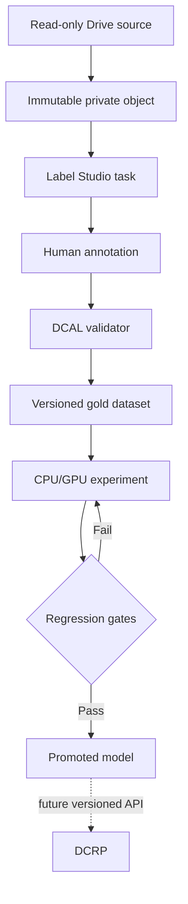

# DCAL architecture

## Purpose

DCAL builds institution-specific page classification and document-reading models from human-reviewed BMCH material. It is an experimental and dataset-governance system, not a clinical record application.

## Boundary

DCAL and DCRP have separate repositories, deployments, databases, credentials, and release cycles. No DCAL experiment may write into DCRP. A future promoted model may be exposed behind a versioned inference API that DCRP calls explicitly.

## Components

1. **Ingestion service** — copies approved Drive pages into immutable private storage, calculates checksums, and generates opaque grouping IDs. This is planned, not implemented.
2. **Label Studio** — human annotation user interface. It displays a single page, page-type controls, quality flags, and region transcription tools.
3. **Dataset adapter** — validates Label Studio output and converts it into the stable `dcal.gold.v1` contract. This repository implements the first adapter.
4. **Dataset registry** — freezes releases and patient/writer-separated train, validation, and sealed-test splits. Planned.
5. **Experiment runner** — launches reproducible CPU/GPU challengers and records code, container, configuration, cost, latency, and metrics. Planned.
6. **Model registry** — promotes a challenger only after regression gates pass. Planned.
7. **Inference gateway** — serves only promoted models with versioned requests and responses. Planned.

## Data flow

## Why the Label Studio database is not canonical

Label Studio is optimized for interactive annotation and can change its export representation across configurations and versions. DCAL therefore stores immutable normalized dataset releases outside Label Studio. The adapter rejects ambiguous multiple annotations rather than silently picking one.

## Security baseline

- Label Studio is self-hosted with PostgreSQL.
- Public signup is disabled; invitations are required.
- SSRF protection is enabled.
- Product analytics are disabled.
- Raw images live outside Git and are mounted read-only for local pilots.
- Internet-facing deployment requires HTTPS, network restriction, backups, access logging, and an institutional data-governance decision. The provided Compose file is a private pilot baseline, not a declaration of regulatory compliance.

## Accuracy layers

Metrics are never collapsed into one headline number:

- Page classification: per-class precision, recall, F1, confusion, abstention, and false-acceptance rate.
- Text: character error rate and word error rate, separated into printed and handwritten content.
- Fields: exact-field accuracy and clinically critical token errors.
- Automation: accepted-result precision at defined confidence thresholds and human-review coverage.
- Operations: latency, cost, failure rate, and image-quality strata.
