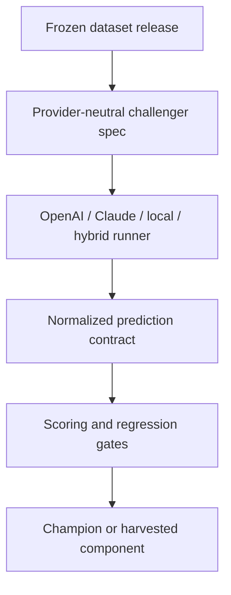
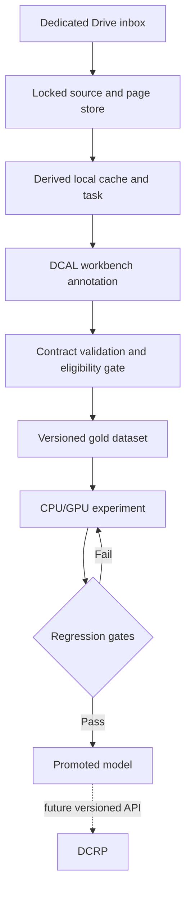

# DCAL architecture

## Purpose

DCAL builds institution-specific page classification and document-reading models from human-reviewed BMCH material. It is an experimental and dataset-governance system, not a clinical record application.

## Boundary

DCAL and DCRP have separate repositories, deployments, databases, credentials, and release cycles. No DCAL experiment may write into DCRP. A future promoted model may be exposed behind a versioned inference API that DCRP calls explicitly.

## Components

1. **Ingestion service** — scans a dedicated Drive, renders pages, calculates checksums, generates opaque grouping IDs, archives originals/pages under content restrictions, and creates idempotent workbench tasks. Implemented for the pilot.
2. **DCAL workbench** — first-party human annotation interface and operational SQLite state. It provides upload, queueing, page/content identification, quality flags, typed regions, transcription, autosave, optimistic concurrency, completion, and revision history.
3. **Dataset adapter/export** — validates completed workbench state and converts provenance-complete pages into stable `dcal.gold.v1`. The prior Label Studio adapter remains for compatibility.
4. **Dataset registry** — freezes releases and patient/writer-separated train, validation, and sealed-test splits. Planned.
5. **Experiment runner** — launches reproducible CPU/GPU challengers and records code, container, configuration, cost, latency, and metrics. Planned.
6. **Model registry** — promotes a challenger only after regression gates pass. Planned.
7. **Inference gateway** — serves only promoted models with versioned requests and responses. Planned.

## Champion/challenger architecture

The experiment system is provider-neutral. OpenAI, Claude, local OCR, Gemini, rules-based preprocessing, and hybrid systems all participate as challengers behind the same DCAL contracts.

Claude participation is expected, but Claude is not a privileged code path. Claude challengers must use the same dataset snapshots, output contract, scoring, cost reporting, and promotion gates as every other provider.

Reusable improvements from all challengers are recorded in `docs/WINNING_COMPONENTS.md`. A losing challenger can still contribute a winning component such as a better preprocessing step, prompt fragment, parser rule, confidence rule, or template-drift detector.

## Data flow

## Why operational annotation state is not canonical

The workbench SQLite database and optional Label Studio database are mutable collaboration state. DCAL therefore stores immutable normalized dataset releases outside either interface. Only completed pages with opaque patient/encounter provenance may enter a gold release.

## Security baseline

- The workbench is self-hosted and bound to `127.0.0.1` by default.
- Its ingestion route requires a separate bearer secret; request logs suppress paths, names, IDs, and document content.
- Browser upload is excluded from dataset export until Drive provenance upgrades the checksum-addressed page.
- Raw images and canonical rendered pages live in the dedicated Drive; the local checksum-addressed cache is rebuildable.
- The optional Label Studio compatibility profile retains disabled public signup, SSRF protection, and disabled product analytics.
- Drive objects are content restricted and audited, but Drive is not represented as true write-once storage.
- Internet-facing deployment requires HTTPS, network restriction, backups, access logging, and an institutional data-governance decision. The provided Compose file is a private pilot baseline, not a declaration of regulatory compliance.

## Accuracy layers

Metrics are never collapsed into one headline number:

- Page classification: per-class precision, recall, F1, confusion, abstention, and false-acceptance rate.
- Text: character error rate and word error rate, separated into printed and handwritten content.
- Fields: exact-field accuracy and clinically critical token errors.
- Automation: accepted-result precision at defined confidence thresholds and human-review coverage.
- Operations: latency, cost, failure rate, and image-quality strata.
